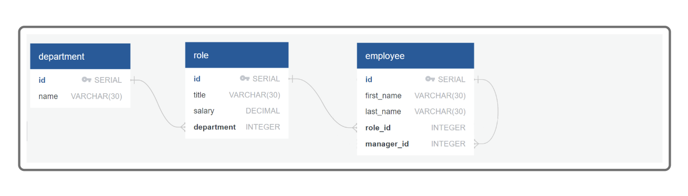
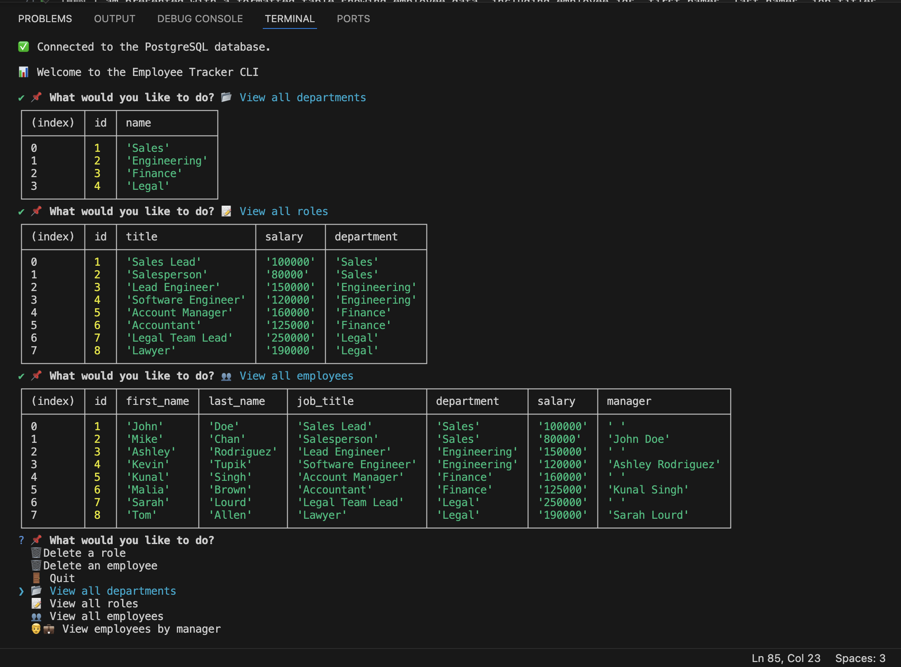

# EmployeeTracker-Cli-App

Developers frequently need to create interfaces that allow non-developers to easily view and interact with information stored in databases. These interfaces are called content management systems (CMS). This project is a command-line application that manages a company's employee database using Node.js, Inquirer, and PostgreSQL. While traditional CMS platforms often have graphical interfaces, this CLI-based CMS enables efficient interaction with employee records through structured prompts, allowing users to add, update, and retrieve employee data seamlessly.

- **Motivation:** The motivation behind this project was to develop a structured and efficient way for businesses to manage their employee records without needing a complex GUI. By leveraging a command-line interface, users can interact with a company's employee database easily and efficiently.
- **Purpose:** The purpose of this application is to provide HR teams and managers with a streamlined way to manage employee information, including departments, roles, salaries, and reporting structures. This CLI tool eliminates the need for manual record-keeping and enables smooth database management.
- **What I Learned:** Through this project, I learned how to integrate PostgreSQL with Node.js, use the pg package for database interactions, and implement Inquirer.js for user-friendly CLI interactions. Additionally, I gained experience with handling SQL queries, foreign key constraints, and managing relational data structures effectively.

## Table of Contents

- [Installation](#installation)
- [Usage](#usage)
- [Credits](#credits)
- [License](#license)
- [Badges](#badges)
- [Features](#features)
- [How to Contribute](#how-to-contribute)
- [Tests](#tests)
- [Video](#video)

## Installation

1. Clone the repository:
   ```sh
   git clone https://github.com/lunahoushmand16/EmployeeTracker-Cli-App
   ```
2. Navigate to the project folder:
   ```sh
   cd EmployeeTrackinr-Cli-App
   ```
3. Install dependencies:
   ```sh
   npm install
   ```
4. Install PostgreSQL package:
   ```sh
   npm install pg
   ```
5. Run the application:
   ```sh
   npm run start
   ```

## Usage

- The application allows users to manage employee records efficiently via a command-line interface.

- Users can view all departments, job roles, and employees in a structured format.

- New employees, roles, and departments can be added dynamically.

- Existing employee roles and managers can be updated easily.

- Employees can be filtered by their department or manager for better organization.

- Users can delete employees, roles, and departments if needed.

- Provides a structured and interactive experience using Inquirer prompts.

### Example And Sample Output:

```
GIVEN a command-line application that accepts user input
WHEN I start the application
THEN I am presented with the following options: view all departments, view all roles, view all employees, add a department, add a role, add an employee, and update an employee role
WHEN I choose to view all departments
THEN I am presented with a formatted table showing department names and department ids
WHEN I choose to view all roles
THEN I am presented with the job title, role id, the department that role belongs to, and the salary for that role
WHEN I choose to view all employees
THEN I am presented with a formatted table showing employee data, including employee ids, first names, last names, job titles, departments, salaries, and managers that the employees report to
WHEN I choose to add a department
THEN I am prompted to enter the name of the department and that department is added to the database
WHEN I choose to add a role
THEN I am prompted to enter the name, salary, and department for the role and that role is added to the database
WHEN I choose to add an employee
THEN I am prompted to enter the employee's first name, last name, role, and manager, and that employee is added to the database
WHEN I choose to update an employee role
THEN I am prompted to select an employee to update and their new role and this information is updated in the database
```

### Screenshots:




## Credits

- Created by **[Luna Houshmans](https://github.com/lunahoushmand16)**
- Built with [Inquirer.js](https://www.npmjs.com/package/inquirer/v/8.2.4) and [Node.js](https://nodejs.org/) 
- Link for info [node-postgres](https://www.npmjs.com/package/pg)
- Link for info [PostgreSQL](https://www.postgresql.org/docs/current/app-psql.html)
- Info about how to choose your license [Licenses](https://choosealicense.com/licenses/)

## License

This project is licensed under the **MIT License**. See the [LICENSE](LICENSE) file for details.

## Badges


## Features

- 👥 View All Employees: Lists all employees with job titles, departments, salaries, and managers.

- ➕ Add a Department: Allows users to create new departments.

- ➕ Add a Role: Enables users to add new job roles.

- ➕ Add an Employee: Facilitates adding new employees with assigned roles and managers.

- ✏️ Update an Employee Role: Modifies an employee's role in the organization.

- 👨‍💼 Update Employee Manager: Assigns or updates an employee's manager.

- 🏢 View Employees by Department: Retrieves employees filtered by department.

- 👨‍💼 View Employees by Manager: Fetches employees reporting to a specific manager.

- 🗑️ Delete Departments, Roles, and Employees: Allows users to remove these tables from the system.

## How to Contribute

1. Fork the repository
2. Create a new branch: `git checkout -b feature-name`
3. Make changes and commit: `git commit -m 'Added new feature'`
4. Push changes: `git push origin feature-name`
5. Open a pull request

## Tests

Install dependencies and run the databse by fierst log-in to database by 'psql -U postgres' and enter your Pass and run \i schema.sql and \i seeds.sql and then Run the application with node index.js or Use 'npm run build && npm run start' to run the CLI app in one step
And start to play around with adding employee, department, managers and Update employee managers, Delete departments, roles, and employees and more ... 

## Video

[Watch the demo](https://app.screencastify.com/v3/watch/2tehEqq17MaAc2aewi40)
